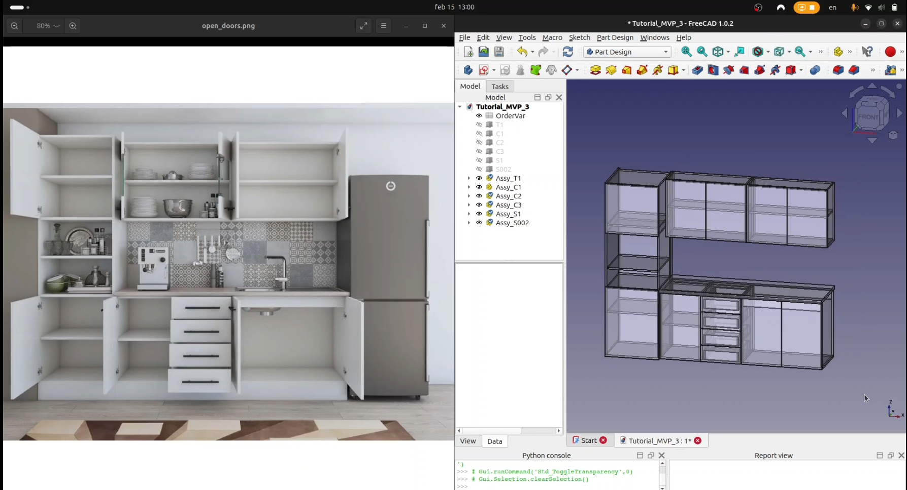

# Cabinet Generator

**AIGenFurniture Cabinet Generator** is a workbench that automates the generation of parametric cabinet furniture from simple placeholder boxes.

Designed for small furniture workshops and independent kitchen designers, it bridges the gap between design intent and production-ready output, all inside FreeCAD, without switching tools.

---

## What It Does

Instead of modeling each cabinet manually, you draw simple rectangular boxes representing your cabinet layout, assign a cabinet type and interior features to each box, and run a single command. The workbench generates the full parametric cabinet geometry and all associated manufacturing files automatically.

**Core workflow:**

1. Draw placeholder boxes in FreeCAD representing cabinet positions
2. Assign a cabinet type: Base, Wall, or Tower Cabinet
3. Assign interior features: fronts, shelves, drawers
4. Run **Explode Cabinet** → full parametric geometry is generated
5. Run **Generate from Geometry** → production files are created

## Resources

- **YouTube tutorials:** [youtube.com/@AIGenFurniture](https://www.youtube.com/@AIGenFurniture)
- **Issues & feedback:** [GitHub Issues](https://github.com/AIGenFurniture/CabinetWorkbench/issues)
- **Contact:** contact@aigenfurniture.com

## Support

- **Ko-fi:** [ko-fi.com/bogdan_aigenfurniture](ko-fi.com/bogdan_aigenfurniture)
- **PayPal** [PayPal Donations](paypal.com/donate/?hosted_button_id=UV2AFNARW4RBN)